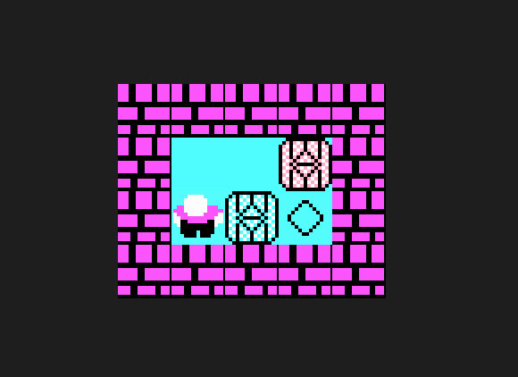

# Sokoban



## Requisitos
Para ejecutar o compilar el proyecto se debe contar con Stack.

## Ejecución
Para ejecutar se debe utilizar el siguiente comando:
```
stack run
```

## Tests
Para correr los tests se debe utilizar el siguiente comando:
```
stack test
```

## Compilación
Para compilar el juego se debe utilizar el siguiente comando:
```
stack build
```
